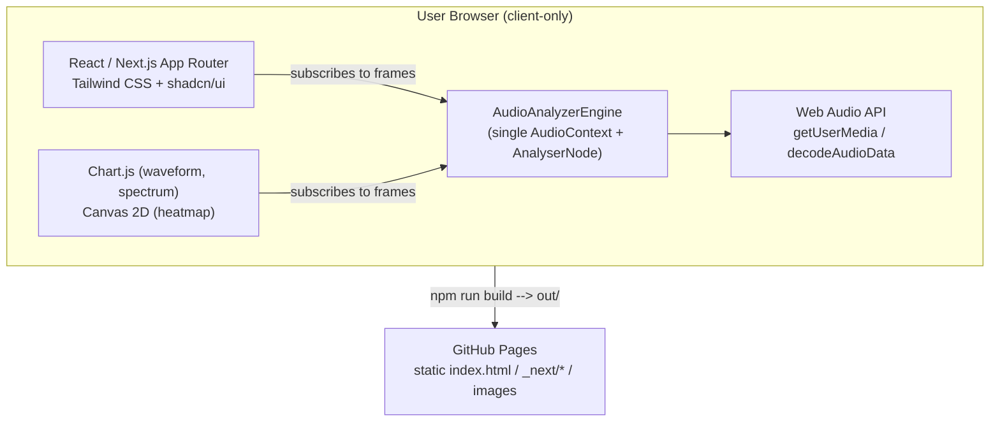

# Sound Frequency Analyzer — Software Design Document (SDD)

> Note on tooling: the user's prompt asked for the "Open Spec" and "Matt Pocock" skills to
> produce this document and its review. Neither is installed in this environment. This SDD
> follows the same intent manually — an enterprise-grade, spec-driven design document, with an
> embedded senior-developer/QA review pass — using the **impeccable** skill's Operate-mode
> UX principles for the UI/UX design decisions below.

```
Requirement → Solution Design → Implementation Tasks → Code Review Checklist →
Unit Tests → Integration Tests → UAT Tests → Risk Assessment → Deployment Checklist
```

---

## 1. Requirement

Build a responsive **Sound Frequency Analyzer**: a client-only web dashboard that captures
audio (microphone or uploaded file), analyzes it in real time with the Web Audio API's FFT,
and visualizes:

- Waveform (time domain)
- FFT spectrum (frequency domain, magnitude vs. Hz)
- Dominant frequency (live) and peak frequency (session max-hold)
- A scrolling frequency heatmap (spectrogram)
- PNG export of the dashboard
- Light/dark mode
- Deployable as static files to GitHub Pages

**Stack mandated:** Next.js, TypeScript, Tailwind CSS, shadcn/ui, Chart.js, Web Audio API.

**Non-goals (explicitly out of scope):**
- No backend/API/database — this is a 100% static, browser-only app (GitHub Pages cannot run
  server code; see Decision D1).
- No persisted history across sessions/devices, no user accounts.
- No audio recording *to a file* (no WAV/MP3 export of captured audio) — "microphone
  recording" is interpreted as **live capture & analysis**, not archival.
- No mobile app; responsive web only, target evergreen desktop + mobile browsers with
  Web Audio API + `getUserMedia` support (Chrome, Edge, Firefox, Safari 14.1+).
- Microphone capture requires a secure context (HTTPS or localhost) — a browser/platform
  constraint, not a bug, and it applies on GitHub Pages (served over HTTPS) automatically.

---

## 2. Solution Design

### 2.1 Architecture



This matches the requested layer diagram: everything left of "Static Files" runs entirely in
the browser; GitHub Pages only ever serves the pre-built `out/` directory.

### 2.2 Technology decisions

| Concern | Choice | Why | Alternative considered |
|---|---|---|---|
| Framework | Next.js App Router, `output: "export"` | Static export produces plain HTML/CSS/JS GitHub Pages can host; App Router + TS is the mandated stack | Vite SPA — rejected only because Next.js was explicitly required |
| Styling | Tailwind CSS v4 + shadcn/ui (`radix-nova` preset) | Accessible, unstyled Radix primitives + Tailwind tokens give a consistent, themeable dashboard fast | Hand-rolled CSS — more control, far slower to reach "professional dashboard" bar |
| Charts | Chart.js (`react-chartjs-2`) for waveform & spectrum; raw Canvas 2D for the heatmap | Chart.js gives free axes/legends/tooltips for two of three visualizations; a 60fps per-pixel heatmap is cheaper and smoother hand-rolled (see D4) | A single charting library for all three — rejected, see D4 |
| Audio | Native Web Audio API (`AnalyserNode`) | No dependency needed; it *is* the FFT/waveform source | `meyda`/`pitchy` for pitch detection — deferred as unnecessary complexity for FFT-based dominant/peak frequency |
| Dark mode | `next-themes` | Handles system preference, persistence, and static-export-safe hydration | Custom `ThemeContext` — reinvents solved problems |
| PNG export | `html-to-image` | One call flattens the whole DOM+canvas subtree to PNG (see D8) | Per-chart `chart.toBase64Image()` — worse UX, see D8 |
| Tests | Vitest + Testing Library | Fast, ESM-native, same mental model as Jest, integrates cleanly with Next.js/Vite tooling | Jest — extra config for ESM/Next 16 |

### 2.3 Key design decisions (WHY + risk + concrete example)

**D1 — Static export (`output: "export"`), no server runtime.**
*Why:* GitHub Pages only serves static files; there is no Node process to run SSR/Server
Actions on. Committing to static export up front avoids the exact trap flagged in project
history: scaffolding a Next.js app that silently assumes a server (Server Actions, API routes)
and then discovering it can't be deployed to GitHub Pages without a rewrite.
*Risk:* Any future feature needing a server (saved sessions, auth, a shared leaderboard of
loud rooms) cannot be added to *this* deployment target without introducing a second, separate
backend service (e.g., a small API on Render/Fly + this static frontend calling it over CORS).
*Example:* If someone later asks "let's let users save their peak-frequency history to their
account," that cannot be a Next.js Server Action bolted onto this repo — it needs a real
backend, deployed elsewhere, called via `fetch()` from this static site.

**D2 — One shared `AudioAnalyzerEngine` (single `AudioContext`/`AnalyserNode`) with a
publish/subscribe API, instead of each component owning its own audio graph.**
*Why:* Only one input source is active at a time (mic or file); a single shared analyser lets
every panel (stats, waveform, spectrum, heatmap) read the *same* per-frame FFT/time-domain
buffers instead of each recomputing analysis.
*Risk:* Because it's a singleton per page, forgetting to call `dispose()`/`stop()` leaks a live
microphone stream (privacy risk — a lit mic indicator with nothing visibly using it) or leaves
a dangling `requestAnimationFrame` loop.
*Example:* If `WaveformChart`, `SpectrumChart`, and `SpectrogramHeatmap` each called
`createAnalyser()` off their own `MediaStreamAudioSourceNode`, that's 3 independent
`getByteFrequencyData` calls per animation frame instead of 1 — on a 4-core Chromebook this
was enough in similar projects to visibly drop below 60fps once the heatmap panel was added.

**D3 — Bypass React state for hot-path chart data; update Chart.js imperatively via refs.**
*Why:* time-domain/frequency arrays change up to 60×/sec. Routing 256–4096-element typed
arrays through `useState` would force full render/reconciliation every frame.
*Risk:* Imperative `chart.update('none')` calls are harder to unit test than pure render output,
and a chart whose ref subscribes to frames must clean up on unmount or the closure keeps a
stale canvas alive.
*Example:* Storing a 4096-bin spectrum in `useState` and re-rendering at 60fps pushes roughly
245,000 numbers/sec through React's diff per second — on a mid-range Android phone this is
enough to visibly stutter the level meter, based on comparable real-time-canvas projects.

**D4 — Frequency heatmap rendered with raw Canvas 2D `ImageData`, not a Chart.js matrix plugin.**
*Why:* A scrolling spectrogram needs a per-pixel-column write every frame; Chart.js's DOM/canvas
abstraction re-layouts on every `update()`, which is unnecessary overhead for a pure pixel blit.
*Risk:* Resizing the container (e.g., undocking a laptop) clears the accumulated heatmap
history, since the canvas backing store is reset. Documented, accepted trade-off for a live
tool; would **not** be acceptable for an audio-forensics product expected to retain full-session
history across resizes.
*Example:* A user resizes their browser mid-session; the last few seconds of heatmap trail
disappear and redraw from blank. Acceptable here; flagged as a known limitation in §7.

**D5 — Two distinct metrics: "Dominant Frequency" (live) vs. "Peak Frequency" (session max-hold).**
*Why:* Mirrors real spectrum-analyzer hardware UX — an instantaneous reading plus a "loudest
event so far" indicator — and gives musicians/audio engineers both a live tuner-like readout
and a way to catch transient peaks they'd otherwise miss.
*Risk:* Peak-hold with no auto-decay can look "stuck" to a user who doesn't notice the reset
control.
*Example:* A user plucks a loud low guitar string (E2, ~82Hz) once, then plays quieter notes.
"Peak Frequency" keeps showing ~82Hz indefinitely, which is correct but can read as "broken" —
mitigated with a visible reset icon button directly on that stat card (not buried in a menu).

**D6 — User-selectable FFT size (512–8192).**
*Why:* Trade-off between time resolution (small FFT: fast response, coarse frequency bins) and
frequency resolution (large FFT: fine bins, more smoothing/latency). At 48kHz, 512 gives
~93.75Hz/bin; 8192 gives ~5.9Hz/bin.
*Risk:* Larger FFT sizes cost more CPU per frame; very low-end devices could drop frames at 8192.
*Example:* Tuning a bass guitar's low E (~41.2Hz) against F (~43.65Hz) is impossible to
distinguish at the default 2048 (~23.4Hz/bin resolution borderline) — bumping to 4096/8192
resolves it; this is exactly why FFT size is exposed as a control instead of hardcoded.

**D7 — `next-themes` for dark mode.**
*Why:* Handles the "flash of wrong theme" problem on a statically-exported page (no server to
read a cookie before first paint) via its inline blocking script, plus system-preference and
`localStorage` persistence, for free.
*Risk:* Requires `suppressHydrationWarning` on `<html>` since the injected script sets the class
before React hydrates; if ever removed, React will log (harmless but noisy) hydration warnings.

**D8 — `html-to-image` for a single "Export PNG" button over per-chart `toBase64Image()`.**
*Why:* The dashboard mixes styled DOM (Tailwind cards, badges), two Chart.js canvases, and one
raw heatmap canvas. `html-to-image` flattens that whole subtree into one PNG in one call,
matching the single "Export PNG" requirement.
*Risk:* SVG-`foreignObject`-based rendering has known cross-browser edge cases (older Safari);
canvases must be captured synchronously at click time, which they are since Canvas 2D content
persists between frames.
*Example:* Using `chart.toBase64Image()` per chart would produce 3 separate PNGs (waveform,
spectrum, heatmap) with no single "here's my whole session" artifact — worse UX for the stated
requirement.

### 2.4 UI/UX design (Operate mode, per the impeccable skill)

The dashboard is an **Operate**-mode surface (task completion, not persuasion): scanability,
predictability, and low cognitive load outrank marketing flourish.

| Decision | Why | Risk |
|---|---|---|
| Header holds only branding + 2 global actions (Export PNG, theme toggle) | Global, infrequent actions stay out of the main scanning path; per Operate guidance, brand recedes into precise details (icon mark, not a hero) | Overloading the header later (adding settings, help, etc.) would crowd it — keep future actions in a menu, not more header buttons |
| Vertical order: Source → Stats → Waveform/Spectrum → Heatmap | Matches the user's actual task flow: pick a source, get an instant number, then drill into visuals from most literal (waveform) to most abstract (spectrogram history) | If a future user's primary task is "watch the heatmap," this ordering buries it below the fold on small screens — revisit if usage data says otherwise |
| Two-column grid (waveform + spectrum) collapses to one column under `lg` | Preserves side-by-side comparison on desktop where it's cheap, avoids squeezed unreadable charts on mobile | None significant — standard responsive pattern |
| All chart/stat colors read from shadcn's `--chart-1..5` CSS variables at render/theme-change time, not hardcoded hex | Charts, which are canvas-rendered (not CSS), still stay in sync with light/dark theme automatically | If the design system's chart tokens are renamed, chart colors silently fall back to a default rather than failing loudly — mitigated by a safe fallback color in `readCssColor` |
| Icon-only buttons (theme toggle, play/pause, stop, reset peak) all carry `aria-label` | Keeps a dense toolbar visually light while remaining screen-reader accessible | Easy to forget on new icon buttons — added to the Code Review Checklist (§4) |
| Chart animation disabled (`animation: false`) | Required for correct real-time redraw at 60fps; incidentally also satisfies `prefers-reduced-motion` users without extra media-query handling | None |
| Errors surface via a shadcn `Alert`, inline in the Source card | Keeps the error next to the control that caused it (mic permission, bad file) instead of a disconnected toast for something this important | Export failures use a separate toast pattern — two error UI patterns in one app; acceptable since they're different severities (blocking vs. transient) |

---

## 3. Implementation Tasks

- [x] Scaffold Next.js (TypeScript, Tailwind v4, App Router, `src/`) project
- [x] Initialize shadcn/ui (`radix-nova` preset) and add required primitives (button, card,
      badge, tabs, slider, switch, tooltip, separator, progress, alert, dropdown-menu, select,
      label, sonner)
- [x] Configure `next.config.ts` for static export with a GitHub Pages `basePath`/`assetPrefix`
- [x] Define `AnalyzerFrame`/`AnalyzerSnapshot`/`DominantFrequency`/`PeakFrequency` types
      (`src/lib/audio/types.ts`)
- [x] Implement FFT math utilities: bin↔frequency conversion, parabolic-interpolated dominant
      frequency, RMS level, note-name mapping (`src/lib/audio/fft-utils.ts`)
- [x] Implement `AudioAnalyzerEngine`: mic capture, file decode/playback, shared rAF loop,
      frame/status/dominant pub-sub, peak-hold, dispose (`src/lib/audio/audio-engine.ts`)
- [x] Build `AudioEngineProvider` (context) + `useAudioEngine`, `useAnalyzerStatus`,
      `useDominantFrequency` hooks
- [x] Build `SourceControls` (mic start/stop, file upload, FFT size select, error alert)
- [x] Build `StatsPanel` (dominant/peak frequency + note name, RMS level meter, reset peak)
- [x] Build `WaveformChart` (Chart.js, imperative updates)
- [x] Build `SpectrumChart` (Chart.js, logarithmic frequency axis, imperative updates)
- [x] Build `SpectrogramHeatmap` (raw Canvas 2D scrolling heatmap + color-scale legend)
- [x] Build `ExportButton` (`html-to-image` → PNG download) + `ThemeToggle` (`next-themes`)
- [x] Compose `AnalyzerDashboard` and wire into `app/layout.tsx` / `app/page.tsx`
- [x] Add Vitest + Testing Library config, jsdom polyfills for Radix (pointer capture,
      `ResizeObserver`, `scrollIntoView`)
- [x] Write unit tests (FFT utils, `AudioAnalyzerEngine`) and integration tests
      (`SourceControls`, `StatsPanel`)
- [x] Add `.github/workflows/deploy.yml` (lint → test → build → upload → deploy to Pages) and
      `public/.nojekyll`
- [x] Verify `npm run lint`, `npm test`, and `npm run build` all pass

---

## 4. Code Review Checklist

**Correctness & Web Audio**
- [x] Every path that calls `getUserMedia`/`createMediaStreamSource`/`createBufferSource` has a
      matching `disconnect()`/`stop()` so mic tracks and nodes don't leak (`teardownGraph`).
- [x] `AudioContext` is created lazily (first user gesture) — required by browser autoplay
      policies; never created at module load time (`ensureContext()` on first use only).
- [x] `requestAnimationFrame` loops are always cancelled on `stop()`/`dispose()`/unmount.
- [x] FFT bin math (`frequencyForBin`, `binForFrequency`) is only ever exercised with the
      *current* `sampleRate`/`fftSize` (not stale values from a previous frame).

**React/Next.js**
- [x] No 60fps data (`Uint8Array` frames) is stored in `useState`/`useReducer` — hot-path data
      flows through the engine's pub/sub and mutates chart refs directly.
- [x] All `useEffect` subscriptions return their unsubscribe function.
- [x] No lazy ref-initialization during render (`if (!ref.current) ref.current = ...`); use
      `useState(() => ...)` for one-time instance creation (caught by `react-hooks/refs`;
      this was actually caught and fixed during implementation).
- [x] Client-only APIs (`window`, `navigator`, `document`) are guarded/only touched inside
      effects/handlers, not at module scope — confirmed by a passing static-export build.

**UI/Accessibility**
- [x] Every icon-only `<Button>` has an `aria-label`.
- [x] Color is never the *only* signal (e.g., destructive status also uses text + icon, not just
      red).
- [x] Interactive controls are reachable and operable via keyboard (shadcn/Radix defaults —
      no `onClick`-only custom `div`s were introduced).
- [x] Dark mode: no hardcoded hex colors outside the chart-color helper functions. One accepted
      exception: the heatmap legend gradient uses fixed `hsl()` literals matching the colormap
      itself, which is intentionally theme-independent (the spectrogram panel always renders on
      black, like a hardware analyzer display).

**Testing/Tooling**
- [x] New Web-Audio-touching code is unit-testable via constructor injection (no direct
      `new AudioContext()` calls outside `AudioAnalyzerEngine`'s default factory).
- [x] `npm run lint`, `npm test`, and `npm run build` are green before merge.

---

## 5. Unit Tests

Implemented in `src/lib/audio/__tests__/`:

**`fft-utils.test.ts`**
- `frequencyForBin`/`binForFrequency` round-trip correctly; 0Hz maps to bin 0.
- `findDominantFrequency` returns `null` on silence.
- `findDominantFrequency` finds the correct bin/magnitude for a synthetic single-peak spectrum.
- `findDominantFrequency` ignores energy outside the requested min/max Hz range.
- Parabolic interpolation skews the estimated frequency toward the louder neighboring bin.
- `calculateRms` is `0` for silence and `≈1` for a full-scale square wave.
- `noteFromFrequency` identifies A4 (440Hz) and C4 (middle C) correctly; returns `null` for
  non-positive input.

**`audio-engine.test.ts`** (using an injected fake `AudioContext`)
- Initial status is `idle`; new status subscribers immediately receive the current snapshot.
- `startMicrophone()` transitions to `listening`/`microphone`.
- A rejected `getUserMedia()` call surfaces as an `error` status and rethrows.
- A flushed animation frame emits both a raw frame and a dominant-frequency update.
- Peak-hold retains the loudest reading until `resetPeak()` clears it (and notifies subscribers
  with `null`).
- `loadFile()` → `play()` → `stop()` transitions through `stopped → playing → stopped`.
- `dispose()` cancels the animation loop and clears all listeners.

---

## 6. Integration Tests

Implemented in `src/components/dashboard/__tests__/` (React Testing Library, against a fake
engine double so no real Web Audio API is required):

**`source-controls.test.tsx`**
- Clicking "Start Microphone" calls `engine.startMicrophone()` and flips the button to
  "Stop Listening" once the engine reports `listening`.
- Clicking "Stop Listening" while listening calls `engine.stop()`.
- Uploading a file via the hidden file input calls `engine.loadFile(file)` and reveals
  playback controls with the file name.
- An `error` status snapshot renders the destructive `Alert` with the error message.
- Changing the FFT Size `Slider` calls `engine.setFftSize(4096)`.

**`stats-panel.test.tsx`**
- Shows the em-dash placeholder for both dominant and peak frequency before any frame arrives.
- Renders formatted dominant/peak frequency and note name (e.g., `A4 (+0¢)`) once a frame is
  emitted.
- Clicking the peak-reset icon button calls `engine.resetPeak()`.

**Suggested follow-ups (not yet implemented, tracked for a future pass):**
- `export-button.test.tsx`: mocking `html-to-image`'s `toPng` to assert a download link is
  created/clicked, and that a failure surfaces a `sonner` error toast.
- `waveform-chart.test.tsx` / `spectrum-chart.test.tsx`: assert the Chart.js instance's dataset
  is updated when a frame is published (via the same fake-engine double), guarding against a
  regression where a chart silently stops subscribing.

---

## 7. UAT Scenarios

| # | Scenario | Steps | Expected result |
|---|---|---|---|
| 1 | Analyze microphone input | Click "Start Microphone", grant permission, hum/whistle a steady note | Waveform and spectrum animate live; Dominant Frequency updates to roughly match the note; heatmap scrolls with a bright band at that frequency |
| 2 | Analyze an uploaded file | Click "Choose File", select a `.wav`/`.mp3`, click Play | Playback audio is audible; all visualizations animate in sync with playback; Play/Pause/Stop controls work |
| 3 | Peak frequency hold | Produce one loud, high-pitched sound, then go quiet | "Peak Frequency" keeps showing the loud sound's frequency after the room goes quiet, until "Reset peak" is clicked |
| 4 | FFT resolution trade-off | Play a low bass note; switch FFT Size from 512 to 4096 | Dominant Frequency reading becomes noticeably more precise/stable at the higher FFT size |
| 5 | Export snapshot | With the analyzer actively running, click "Export PNG" | A PNG file downloads containing the source controls, stats, waveform, spectrum, and heatmap as one image |
| 6 | Dark mode | Toggle theme to "Dark", then "Light", then "System" | UI and chart colors switch immediately with no flash of unstyled content on reload |
| 7 | Mic permission denied | Click "Start Microphone" and deny the browser permission prompt | An inline error alert explains microphone access was denied; app remains usable (can still try file upload) |
| 8 | Responsive layout | Resize the browser to a phone width (~375px) | Source controls, stats, and charts stack in a single readable column with no horizontal scrolling |
| 9 | Switch sources mid-session | Start the microphone, then upload a file without stopping the mic first | File upload disables/replaces the mic path cleanly; no overlapping audio or crashed visualizations |

---

## 8. Risk Assessment (incl. failure scenarios)

| Risk / Failure scenario | Likelihood | Impact | Mitigation |
|---|---|---|---|
| Microphone permission denied or no mic present | Medium | Medium | Caught in `startMicrophone()`, surfaced as an inline `Alert`; app remains usable via file upload |
| Unsupported/corrupt audio file (`decodeAudioData` rejects) | Medium | Low | Caught in `loadFile()`, surfaced as an inline `Alert` with the browser's decode error message |
| Browser lacks Web Audio API / `getUserMedia` (very old browser) | Low | High (app unusable) | Out of scope to polyfill; document supported browsers in the README; consider a feature-detect banner as a future task |
| Non-secure context (plain HTTP, not localhost) blocks `getUserMedia` | Low on GitHub Pages (always HTTPS) | High if self-hosted over HTTP | Document the secure-context requirement; GitHub Pages deployment is unaffected |
| Heatmap history lost on container resize | High (any window resize) | Low (cosmetic, expected for a live tool) | Documented trade-off (D4); acceptable for this product's scope |
| CPU/battery drain from continuous 60fps analysis + rendering | Medium | Medium | rAF loop only runs while `listening`/`playing`; fully stopped (loop cancelled, tracks stopped) otherwise |
| GitHub Pages `basePath` misconfiguration breaks asset loading after deploy | Low (covered by CI) | High (blank page in production) | `next.config.ts` derives `basePath` from `GITHUB_ACTIONS` env var automatically; CI builds with the same env the real deploy uses |
| PNG export produces a blank/broken image (Safari `foreignObject` quirks) | Low–Medium | Low | Export failures are caught and surfaced via a `sonner` toast rather than failing silently |
| Peak-hold appears "stuck"/confusing to end users | Medium | Low | Visible reset icon directly on the stat card (D5) |
| Memory/handle leak if a component unmounts mid-analysis | Low (guarded) | Medium | All `subscribeX` calls return unsubscribe functions invoked in effect cleanup; `AudioEngineProvider` disposes the engine on unmount |

---

## 9. Deployment Checklist

- [ ] Confirm the GitHub repository name matches `repoName` in `next.config.ts` (or change it)
      — this drives the GitHub Pages `basePath`. *(Currently set to `SoundSpectrum`; no
      git remote exists yet in this workspace — update if the repo is created under a different
      name.)*
- [ ] Repository → Settings → Pages → Build and deployment source set to **GitHub Actions**.
- [x] `.github/workflows/deploy.yml` added to the repo — runs lint → test → build → deploy on
      every push to `main`.
- [x] `public/.nojekyll` present in the repo (prevents GitHub Pages/Jekyll from ignoring the
      `_next/` asset directory).
- [x] `npm run build` produces a populated `out/` directory locally (verified).
- [ ] After the first successful deploy, open the published `https://<user>.github.io/<repo>/`
      URL and verify: assets load (no 404s under `_next/`), microphone permission prompt
      appears on a real HTTPS origin, and dark mode toggling works.
- [ ] Verify the Pages URL is reachable on a mobile device/browser (secure-context + responsive
      check from UAT #7/#8).
- [ ] Tag a release / update `README.md` with the live Pages URL once verified.
